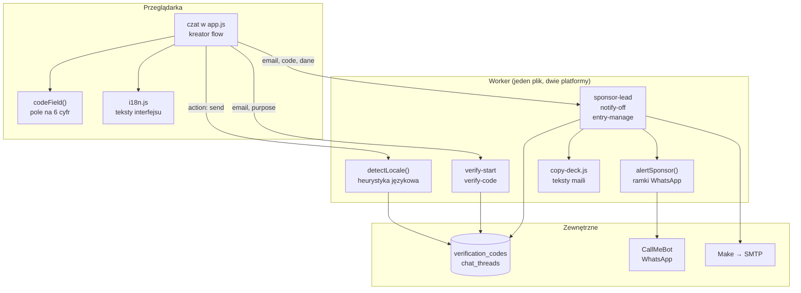
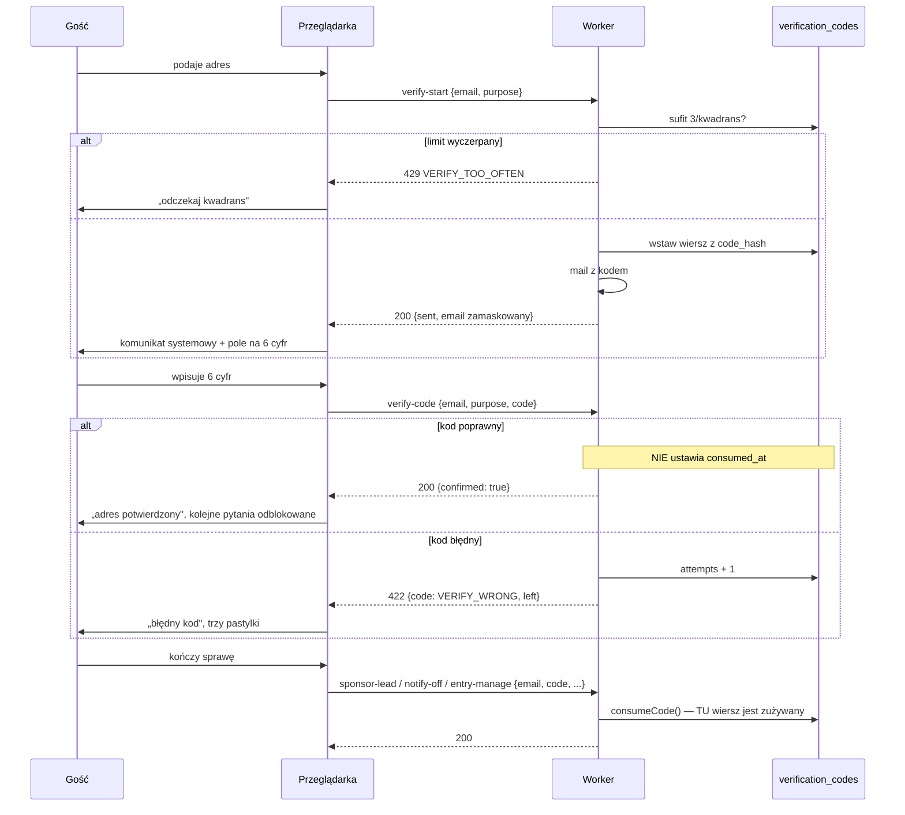
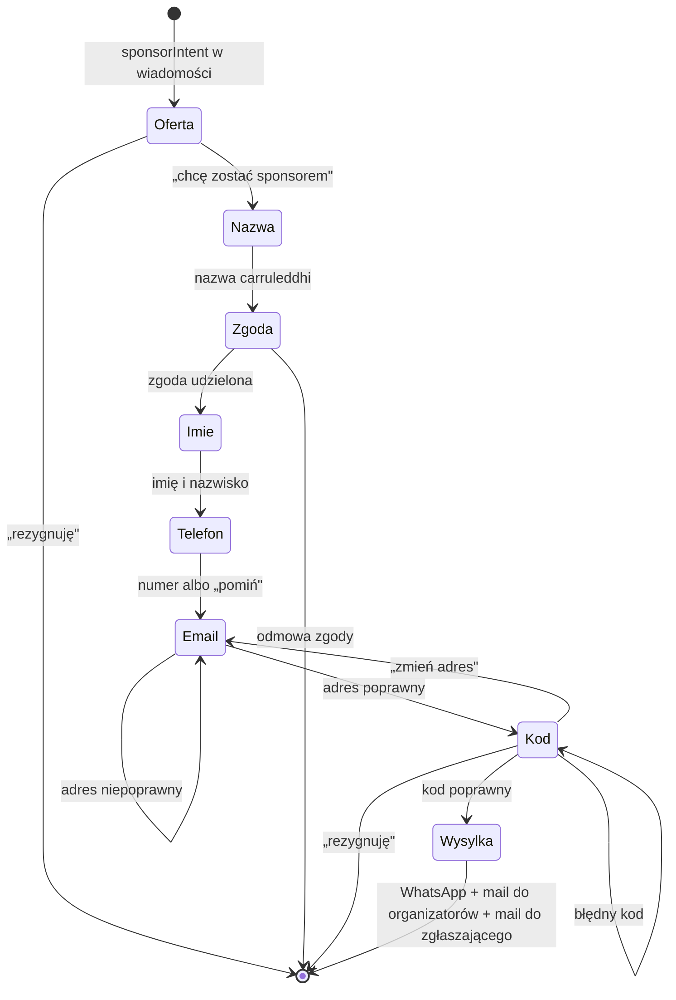

# Design Document

Weryfikacja e-maila w rozmowie i zgłoszenie sponsora.

## Overview

Projekt dokłada trzy rzeczy i nie przebudowuje niczego, co działa.

**Rozpoznawanie języka** dostaje własną funkcję po stronie Workera, opartą na słowach
funkcyjnych i znakach diakrytycznych — bez dodatkowego zapytania do modelu. Wynik trafia do
instrukcji systemowej, do wyboru bloku językowego dla słownika FAQ i do `chat_threads.locale`,
który już istnieje i ma ograniczenie na te same sześć języków.

**Bramka weryfikacyjna** powstaje jako jedna para końcówek (`verify-start`, `verify-code`) plus
jeden komponent w czacie. Kluczowa decyzja: `verify-code` **sprawdza kod, ale go nie zużywa**.
Zużycie zostaje tam, gdzie było — w końcówce wykonującej czynność, która nadal dostaje parę
(adres, kod) w tym samym żądaniu. Dzięki temu „odblokowanie kolejnych pytań" jest stanem
przeglądarki, a nie nowym poświadczeniem, i ograniczenie O5 zostaje nienaruszone.

**Zgłoszenie sponsora** rozszerza istniejący `sponsor-lead` o imię, nazwisko, zgodę i kod, robi
e-mail obowiązkowym, dokłada ramkę WhatsApp w języku odbiorcy i maila do zgłaszającego.

Jedna migracja: nowa wartość `sponsor` w `verification_codes.purpose`.

---

## Architecture

### Gdzie co mieszka



### Bramka: dwa żądania na sprawdzenie, trzecie na czynność



Trzecie żądanie jest tym, które naprawdę autoryzuje. Dwa pierwsze to wygoda rozmowy.

### Zgłoszenie sponsora, krok po kroku



Zgoda stoi między nazwą a pytaniami o kontakt — dokładnie tam, gdzie zaczyna się zbieranie
danych osobowych, i ani o krok wcześniej.

---

## Components and Interfaces

### 1. `detectLocale(text, fallback)` — Worker

Czysta funkcja, bez wejścia i wyjścia poza argumentami. Zwraca jeden z sześciu kodów.

**Dlaczego heurystyka, a nie zapytanie do modelu.** Zapytanie byłoby dokładniejsze i kosztowało
jedno wywołanie na każdą wiadomość — także na „ok" i „grazie", czyli tam, gdzie i tak nie ma
czego rozpoznawać. Przy sześciu językach o rozłącznych słowach funkcyjnych heurystyka jest
darmowa, deterministyczna i daje się sprawdzić bez sieci, co znaczy, że da się ją objąć
checkerem, a nie tylko sondą.

Punktacja składa się z dwóch źródeł:

| Źródło | Waga | Przykłady |
|---|---|---|
| Słowa funkcyjne, całe wyrazy | 2 | `che`, `sono`, `dove` → it · `czy`, `jest`, `gdzie` → pl · `ist`, `wie`, `nicht` → de |
| Znaki wyłączne dla języka | 3 | `ą ć ę ł ń ś ź ż` → pl · `ñ ¿ ¡` → es · `ä ö ü ß` → de · `ç œ` → fr |

Znaki wspólne (`à è é ì ò ù`) nie punktują same — występują we włoskim, francuskim i hiszpańskim.
Punktują wyłącznie w połączeniu ze słowem funkcyjnym tego samego języka.

**Próg i wynik.** Zwycięzca musi mieć co najmniej 2 punkty i wyprzedzać drugiego o co najmniej
2 punkty. Inaczej funkcja zwraca `fallback`. To celowo ostrożne: przy „ok" wynik jest zero-zero
i lepiej zostać w języku, który już był ustalony, niż przeskakiwać na włoski przy każdym
potwierdzeniu.

**Lepkość wątku.** Rozpoznany język jest zapisywany w `chat_threads.locale` tylko wtedy, gdy
rozpoznanie było pewne. Przy niepewnym `fallback` to najpierw `thread.locale`, potem
`payload.locale` z przeglądarki, na końcu `it`. Kolejność jest istotna: raz ustalony język
rozmowy waży więcej niż przełącznik na stronie, bo gość mógł nie zmieniać przełącznika, a pisze
po włosku.

### 2. `verify-start` — Worker

```
POST /api/carruleddhi/verify-start
{ email: string, purpose: 'sponsor'|'unsubscribe'|'edit-entry'|'cancel-entry', locale?: string }
→ 200 { ok: true, email: "ma•••••@example.com", sent: boolean }
→ 422 { ok: false, code: 'VERIFY_BAD_EMAIL' }
→ 429 { ok: false, code: 'VERIFY_TOO_OFTEN' }
```

Jedna końcówka na wszystkie cele zastępuje `notify-code` i `entry-code` w części dotyczącej
wysyłki kodu. **`notify-code` i `entry-code` zostają** — wołają je istniejące ścieżki
(odsyłacz z maila, formularz zarządzania zgłoszeniem) i przepisywanie ich to ryzyko bez zysku.
`verify-start` deleguje do tej samej wewnętrznej funkcji, więc reguły są jedne.

Sufit z `overCodeSendLimit` obowiązuje, z zakresem celów odpowiadającym sprawie: `sponsor`
osobno, `unsubscribe` osobno, `edit-entry` i `cancel-entry` razem — bo te dwie idą na tę samą
skrzynkę i trzy listy w kwadrans to trzy listy.

Dla celu `sponsor` odpowiedź jest zawsze taka sama, niezależnie od tego, czy adres jest gdziekolwiek
znany: tu nie ma listy, do której można by należeć, więc nie ma czego ujawnić. Dla pozostałych
celów obowiązuje O6 i odpowiedź jest identyczna dla adresu znanego i nieznanego.

### 3. `verify-code` — Worker

```
POST /api/carruleddhi/verify-code
{ email: string, purpose: string, code: string }
→ 200 { ok: true, confirmed: true }
→ 422 { ok: false, code: 'VERIFY_WRONG', left: number }
→ 422 { ok: false, code: 'VERIFY_EXPIRED' | 'VERIFY_NO_CODE' }
→ 429 { ok: false, code: 'VERIFY_TOO_MANY_TRIES' }
```

Sprawdza tak jak `consumeCode`, z jedną różnicą: **nie ustawia `consumed_at`**. Wymaga to
wydzielenia z `consumeCode` funkcji `checkCode(env, email, purpose, code, entryId, { consume })`,
z której obie ścieżki korzystają — jedna z `consume: true`, druga z `false`. Rozdzielenie na dwie
niezależne kopie tej logiki byłoby dwoma miejscami, w których reguła ważności i liczba prób mogą
się rozjechać.

Nieudana próba liczy się do limitu pięciu tak samo jak dotąd. To jest cała obrona przed
zgadywaniem i dlatego `verify-code` nie może być „tanim" sprawdzeniem bez skutków.

### 4. `codeField()` — przeglądarka

Nowy komponent w czacie, rysowany jako wiersz systemowy. Klasa `.chat__code`.

```
<div class="chat__code">
  <input inputmode="numeric" autocomplete="one-time-code" maxlength="6"
         pattern="\d*" aria-label="…" data-chat-code>
  <span class="chat__code-hint" data-chat-code-hint></span>
</div>
```

Cztery decyzje:

- `inputmode="numeric"` daje na telefonie klawiaturę cyfrową — to jest to „szybkie" pole
  z zamówienia. `type="text"`, nie `type="number"`: liczba dostaje strzałki, gubi wiodące zera
  i pozwala wpisać `e` oraz `-`.
- `autocomplete="one-time-code"` sprawia, że system podsuwa kod z powiadomienia, jeśli go
  zobaczy. Nic nie kosztuje, a na iOS oszczędza całe przepisywanie.
- Wysyłka po **szóstej cyfrze**, bez przycisku. Wklejenie sześciu cyfr też wysyła, bo warunek
  jest na długości po odsianiu nie-cyfr, a nie na zdarzeniu klawiatury.
- Pole **nie jest** polem wiadomości czatu. Kod wpisany w zwykłe pole poleciałby jako wiadomość
  do wątku i wylądowałby w historii oglądanej przez organizatora. Sześciocyfrowy kod w cudzej
  skrzynce nie ma czego tam robić.

### 5. Kreator: stan i przejścia — przeglądarka

`flow` zyskuje pola `purpose`, `email`, `confirmed`, `code` oraz `consent`. Trzy nowe funkcje
obok istniejących `flowSay` / `flowChoices` / `flowGuard`:

| Funkcja | Zadanie |
|---|---|
| `gateStart(email, purpose)` | woła `verify-start`, wypisuje komunikat systemowy, rysuje `codeField()` |
| `gateCheck(code)` | woła `verify-code`; przy sukcesie ustawia `flow.confirmed = true` i `flow.code = code`, przy porażce rysuje trzy pastylki |
| `gateChoices()` | trzy pastylki: `chat.gateResend`, `chat.gateChangeEmail`, `chat.dataCancel` |

`flow.code` trzymany w pamięci **tylko** do końcowego żądania. Nie idzie do `localStorage`:
zapamiętany kod przeżywałby zamknięcie karty i leżał w pamięci trwałej bez powodu.

**Automat wie o potwierdzeniu**, bo `flow.confirmed` blokuje ponowne pytanie o adres i ponowną
propozycję weryfikacji. Dopóki kreator działa, `flowHandled` przechwytuje wiadomości gościa
i model ich nie widzi — czyli nie ma jak zaproponować weryfikacji drugi raz.

### 6. `alertSponsor(env, lead)` — Worker

Zastępuje wbudowaną w `sponsorLead` pętlę po numerach. Ramka po locale numeru, dane dosłownie.

```
SPONSOR_FRAMES = {
  pl: { head: '🤝 *CARRULEDDHI — SPONSOR*', cart: '🛒 Nazwa na carruleddhi',
        who: '👤 Osoba', phone: '📞 Telefon', email: '✉️ E-mail',
        note: 'Chętny do współpracy. Oddzwoń.' },
  it: { … }
}
```

Sześć języków, choć numery są dziś dwa: lista numerów jest konfiguracją, nie kodem, i trzeci
numer z innym językiem nie ma wymagać zmiany w pliku.

Ramka jest tłumaczona, **dane nie**. Nazwa carruleddhi i imię idą tak, jak je ktoś wpisał —
tłumaczenie nazwy własnej to najkrótsza droga do zgłoszenia, którego nie da się skojarzyć
z osobą, która dzwoni.

Awaria kanału zapisywana przez istniejące `noteWhatsappFailure` i nie zamieniana w odmowę
(O7). Ta funkcja jest bliźniacza do pętli w `alertOrganisers`, więc obie dostają wspólny
pomocnik `sendWhatsapp(env, textFor)` — czytanie treści odpowiedzi CallMeBota przy statusie 200
jest zbyt łatwe do zgubienia przy kopiowaniu.

### 7. `sponsor-lead` — zmiany w kontrakcie

```
POST /api/carruleddhi/sponsor-lead
{ cartName, firstName, lastName, email, code, phone?, consent: true, locale }
→ 200 { ok: true }
→ 422 { ok: false, code: 'SPONSOR_BAD_NAME' | 'SPONSOR_BAD_EMAIL' | 'SPONSOR_BAD_PERSON'
                        | 'SPONSOR_NO_CONSENT' | 'SPONSOR_BAD_CODE' }
```

Zmiany wobec dzisiejszego stanu:

- `email` **wymagany**; `SPONSOR_NO_CONTACT` znika, bo nie ma już przypadku „żadnego kontaktu".
- `firstName`, `lastName`, `consent`, `code` dochodzą do `ALLOWED_FIELDS` dla tego typu.
- `consent !== true` → odmowa. Zgoda sprawdzana po stronie serwera, bo pastylka w przeglądarce
  jest sugestią, nie dowodem.
- `consumeCode(env, email, 'sponsor', code)` przed czymkolwiek, co wychodzi na zewnątrz.
  Kolejność jest treścią wymagania 5.6: najpierw zużycie kodu, potem powiadomienia.
- Trzy wysyłki po potwierdzeniu: WhatsApp, mail do organizatorów, mail do zgłaszającego.

### 8. Mail do zgłaszającego

Składany w Workerze, z tekstami z `COPY_DECK[locale]`. Klucze: `sponsorAckSubject`,
`sponsorAckHeading`, `sponsorAckLead`, `sponsorAckSummary`, `sponsorAckSoon`.

**Dlaczego HTML w Workerze, a nie nowy szablon w generatorze.** Mail do organizatorów już tak
powstaje, w tej samej funkcji, i jest to jeden akapit z podsumowaniem — nie ma tu układu, który
trzeba oglądać w przeglądarce przed wysłaniem. Dołożenie szablonu do
`tools/build-make-blueprints.mjs` znaczyłoby ruszanie generatora, który produkuje też blueprinty
Make, czyli zmiana w pliku niosącym żywą automatykę dla jednego akapitu. Teksty i tak idą do
`emails/copy.json`, więc `check-refs.mjs` pilnuje sześciu języków — to jest ta część, która
naprawdę bywa niekompletna.

---

## Data Models

### `verification_codes` — jedna nowa wartość

```sql
-- 0032_sponsor_code_purpose.sql
alter table public.verification_codes drop constraint verification_codes_purpose_check;
alter table public.verification_codes add constraint verification_codes_purpose_check
  check (purpose in ('unsubscribe','manage-entry','edit-entry','cancel-entry','sponsor'));
```

Ograniczenie zdejmowane po nazwie **wyszukanej w `pg_constraint`**, nie zgadywanej — tak jak
w `0016` i `0018`. Migracja, która zgaduje nazwę ograniczenia, wywala się na cudzej instalacji.

`entry_id` zostaje `null` dla celu `sponsor`: nie ma zgłoszenia, do którego kod by należał.

### `chat_threads.locale` — bez migracji

Kolumna istnieje, `not null default 'it'`, z ograniczeniem na te same sześć języków. Zapisywana
przy pewnym rozpoznaniu języka. Zgodność ograniczenia z zestawem języków `detectLocale` jest
warunkiem, który powinien pilnować checker — rozjazd tutaj to odrzucony zapis wątku bez błędu
widocznego dla gościa.

### Czego nie dodajemy

Żadnej tabeli na dane sponsorów (O3). Jedynym śladem w bazie jest wiersz kodu, który wygasa po
kwadransie i zostaje zużyty. Zgłoszenie żyje w skrzynce i na WhatsAppie ludzi, którzy na nie
odpowiadają.

---

## Error Handling

| Sytuacja | Odpowiedź serwera | Co widzi gość |
|---|---|---|
| Adres niepoprawny składniowo | 422 `VERIFY_BAD_EMAIL` | prośba o adres jeszcze raz, dane z poprzednich kroków zachowane |
| Czwarty kod w kwadransie | 429 `VERIFY_TOO_OFTEN` | ile odczekać; kreator zostaje otwarty |
| Kod błędny | 422 `VERIFY_WRONG` + `left` | „błędny kod", liczba prób, trzy pastylki |
| Kod wygasł albo nie istnieje | 422 `VERIFY_EXPIRED` / `VERIFY_NO_CODE` | to samo co przy błędnym, z innym zdaniem |
| Piąta nieudana próba | 429 `VERIFY_TOO_MANY_TRIES` | „potrzebny nowy kod", trzy pastylki |
| Brak zgody w żądaniu | 422 `SPONSOR_NO_CONSENT` | zdanie ogólne o niepowodzeniu; nie powinno się zdarzyć z naszej strony |
| WhatsApp odmawia | zapis w `noteWhatsappFailure`, odpowiedź 200 | „dziękujemy" — zgłoszenie doszło mailem |
| Mail do zgłaszającego nie wychodzi | zapis, odpowiedź 200 | „dziękujemy" — organizatorzy już mają zgłoszenie |
| Zerwany odczyt przy sprawdzaniu limitu | przepuszcza | nic; limit nie działa w tym okienku |

Dwie zasady, które to porządkują:

**Odmowa nie kończy rozmowy.** Każdy błąd bramki zostawia kreator otwarty i pokazuje wyjście.
Dziś `flowGuard` kończy kreator na wszystkim poza `chat.dataCodeWrong`; to się rozszerza na
wszystkie stany kodu, bo z każdego z nich jest sensowne wyjście.

**Awaria kanału nie jest odmową dla gościa.** Zgłoszenie, które doszło choćby jednym kanałem,
jest zgłoszeniem przyjętym. Odwrotna decyzja znaczyłaby, że cicha awaria WhatsAppa odsyła
sponsora z niczym.

---

## Correctness Properties

Niezmienniki, które muszą zachodzić po każdej zmianie w tym obszarze. Każdy z nich da się
sprawdzić i każdy opisuje sposób, w jaki ta konstrukcja może cicho przestać chronić.

### Property 1: nic nie wychodzi na zewnątrz przed zużyciem kodu

Dla każdego udanego zgłoszenia sponsora `consumeCode` kończy się sukcesem **przed** pierwszym
`fetch` do CallMeBota i przed pierwszym `sendThroughOutbox`. Odwrotna kolejność znaczyłaby, że
błędny kod i tak dzwoni do organizatorów — czyli weryfikacja jest ozdobą.

**Validates: Requirements 5.6, 6.1, 7.1**

### Property 2: potwierdzenie po stronie przeglądarki nie daje żadnej władzy

Dla każdej czynności wymagającej potwierdzenia: usunięcie sprawdzenia po stronie serwera zmienia
wynik. Innymi słowy `flow.confirmed = true` ustawione ręcznie w konsoli nie wykonuje niczego,
bo końcowe żądanie i tak niesie parę (adres, kod), a serwer i tak ją sprawdza.

**Validates: Requirements 2.5, 5.6**

### Property 3: kod jednego celu nie działa na inny

Dla każdych dwóch różnych celów `a ≠ b`: kod wystawiony na `a` odrzucony przy czynności o celu
`b`. Wynika to z filtra po `purpose`, ale jest własnością, którą łatwo zgubić przy dodawaniu
trzeciej ścieżki, która „na chwilę" pyta bez celu.

**Validates: Requirements 3.5**

### Property 4: liczba prób jest wspólna dla sprawdzenia i dla zużycia

Nieudana próba w `verify-code` podnosi ten sam licznik, który widzi końcowa czynność. Gdyby
`verify-code` liczyło osobno albo nie liczyło wcale, zgadywanie kodu byłoby darmowe — a to jest
jedyna obrona przed zgadywaniem sześciu cyfr.

**Validates: Requirements 2.7, 2.11**

### Property 5: sufit wysyłki jest rozdzielony po celach, ale nie do obejścia

Dla jednego adresu: liczba kodów wysłanych na cel w kwadransie nie przekracza trzech. Zmiana celu
nie zeruje licznika innego celu, a przejście przez `verify-start` i `notify-code` nie daje razem
sześciu — obie drogi liczą w tej samej tabeli.

**Validates: Requirements 2.12**

### Property 6: odpowiedź nie zależy od tego, czy adres jest na liście

Dla celów `unsubscribe`, `edit-entry` i `cancel-entry`: odpowiedź `verify-start` dla adresu
nieznanego jest nieodróżnialna od odpowiedzi dla znanego — ten sam status, to samo ciało, ten sam
czas z dokładnością niedającą się wykorzystać. Cel `sponsor` jest z tego wyłączony, bo nie ma
listy, do której można by należeć.

**Validates: Requirements 3.6**

### Property 7: kod nigdy nie trafia do wątku rozmowy

Żadna wartość wpisana w `codeField()` nie tworzy wiersza w `chat_messages` ani bąbelka gościa.
Sześciocyfrowy kod jest poświadczeniem, a wątek jest czytany przez organizatora w panelu.

**Validates: Requirements 2.2, 2.4**

### Property 8: teksty widoczne dla gościa istnieją w sześciu językach

Dla każdego klucza użytego przez bramkę i przepływ sponsora: klucz rozwiązuje się w każdym
z sześciu języków. Brakujący klucz nie wywala strony — pokazuje surową nazwę klucza, czyli
awarię widoczną dla gościa i niewidoczną w logach.

**Validates: Requirements 2.3, 6.2, 7.2**

### Property 9: awaria kanału nie zamienia się w odmowę

Dla każdego zgłoszenia, które przeszło weryfikację: niepowodzenie WhatsAppa albo maila do
zgłaszającego daje odpowiedź 200 i zapis powodu. Jedyny wyjątek to niepowodzenie zapisu kodu —
wtedy nie ma czym potwierdzić i odmowa jest uczciwa.

**Validates: Requirements 6.6, 7.5**

### Property 10: zestaw języków jest jeden

`detectLocale`, ograniczenie `CHECK` na `chat_threads.locale`, bloki w `i18n.js`, bloki
w `copy.json` i klucze `SPONSOR_FRAMES` opisują ten sam zestaw sześciu kodów. Rozjazd w którymkolwiek
z tych pięciu miejsc daje albo odrzucony zapis, albo surowy klucz na ekranie.

**Validates: Requirements 1.1, 1.2**

---

## Testing Strategy

Trzy poziomy, bo trzy różne rzeczy mogą tu pęknąć.

### Bez przeglądarki i bez bazy — `tools/check-*.mjs`

Wpięte w `npm run make`, czyli w `npm run check`.

- `detectLocale` na zestawie zdań: po dwa–trzy na każdy z sześciu języków, plus przypadki
  wieloznaczne (`ok`, `grazie`, `no`), plus tekst bez liter. Ta funkcja jest czysta, więc to
  jest miejsce, w którym naprawdę da się ją sprawdzić — i jedyny powód, dla którego wybrano
  heurystykę zamiast modelu.
- Zestaw języków `detectLocale` zgodny z ograniczeniem `CHECK` na `chat_threads.locale`.
- Nowa migracja: obecność `drop constraint` przed `add constraint`, wyszukanie nazwy
  w katalogu, komplet pięciu wartości. `check-migrations.mjs` ma już te wzorce.
- Komplet nowych kluczy w sześciu językach: `check-i18n.mjs` dla interfejsu, `check-refs.mjs`
  dla `sponsorAck*` w `copy.json`.
- Ramki `SPONSOR_FRAMES` kompletne dla sześciu języków i pozbawione miejsc na dane — czyli
  żadnego `%NAME%` w ramce, bo dane są dokładane, nie podstawiane.

### W przeglądarce — nowa sonda `tools/probe-chat-gate.mjs`

Podglądowy serwer nie ma Workera, więc żądania odbijają się natychmiast. To wystarcza do
sprawdzenia rzeczy, które są czystym interfejsem, a te są tu najliczniejsze:

- pole na kod ma `inputmode="numeric"` i `autocomplete="one-time-code"`;
- wpisanie pięciu cyfr **nie** wysyła, szóstej wysyła;
- wklejenie sześciu cyfr wysyła;
- litery i spacje są odsiewane, a nie odrzucane z błędem;
- pole na kod nie jest polem wiadomości — wpisanie kodu nie tworzy bąbelka gościa;
- komunikat bramki ma klasę `.chat__system`, a nie `.chat-msg--ai`;
- trzy pastylki po błędnym kodzie mają cele dotykowe co najmniej 44 px;
- zgoda w przepływie sponsora stoi **przed** pytaniem o telefon: po podaniu nazwy w wątku nie
  ma jeszcze pytania o kontakt.

### Ręcznie, przeciw produkcji, po wdrożeniu

Trzy rzeczy, których nie da się sprawdzić bez żywych kanałów, i które trzeba przejść raz:

1. Kod naprawdę dochodzi na skrzynkę i wpisany odblokowuje kolejne pytania.
2. WhatsApp dochodzi na oba numery, każdy w swoim języku.
3. Mail do zgłaszającego dochodzi w języku rozmowy.

Punkty 2 i 3 wymagają uzupełnionych sekretów, w tym przegenerowanych kluczy CallMeBota.

---

## Decisions and rationale

| Decyzja | Alternatywa | Dlaczego tak |
|---|---|---|
| Heurystyka językowa | zapytanie do modelu o język | darmowa, deterministyczna, sprawdzalna checkerem; model kosztuje wywołanie na każde „ok" |
| `verify-code` nie zużywa kodu | zużycie przy sprawdzeniu i osobny bilet | bilet to drugie poświadczenie i nowy stan do utrzymania; czynność nadal dostaje parę (adres, kod), więc O5 zostaje spełnione literalnie |
| Osobne pole na kod | kod wpisywany w pole wiadomości | kod w polu wiadomości trafia do wątku i do historii oglądanej przez organizatora |
| `verify-start` obok `notify-code` | przepisanie istniejących końcówek | te ścieżki działają i mają swoje wejścia z maili; wspólna jest funkcja pod nimi, nie adres |
| HTML maila w Workerze | nowy szablon w generatorze | jeden akapit; generator produkuje też blueprinty Make, więc jest droższy w ruszaniu niż zysk |
| `SPONSOR_FRAMES` na sześć języków | dwa, tyle ile numerów | numery są konfiguracją; trzeci numer nie ma wymagać zmiany kodu |
| Zgoda po nazwie carruleddhi | zgoda na samym początku | przed nazwą nie zbieramy jeszcze niczego osobowego, więc nie ma na co się zgadzać |

## Co ten projekt świadomie pomija

- **Nie zmienia reguł kodów.** Sześć cyfr, kwadrans, pięć prób, jednorazowość — to zostaje
  w bazie i w `checkCode`.
- **Nie przepisuje `openEntryManager`.** Bramka podaje mu potwierdzenie; formularz zostaje
  jedyną drogą do kilkunastu pól z walidacją.
- **Nie dodaje weryfikacji do zapisów na wyścig.** Zapis jest tworzeniem własnych danych, nie
  ruszaniem cudzych, i ma własną obronę.
- **Nie rusza `alertOrganisers`** poza wydzieleniem wspólnego pomocnika do wysyłki WhatsAppa.
