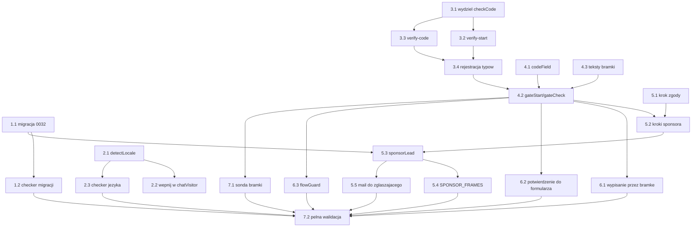

# Implementation Plan

## Overview

Kolejność jest zależnościowa, nie tematyczna. Migracja i wydzielenie `checkCode` idą pierwsze,
bo bez nich reszta nie ma na czym stanąć. Bramka w czacie powstaje przed przepływem sponsora,
bo sponsor jest jej pierwszym klientem, a nie odwrotnie.

Siedem grup, dwadzieścia zadań. Dwie grupy da się prowadzić równolegle — patrz graf zależności
niżej.

## Task Dependency Graph



Grupa 2 (język) nie zależy od niczego w grupach 1 i 3, więc może iść równolegle. Grupa 6
(pozostałe sprawy) zależy tylko od gotowej bramki 4.2, więc może iść równolegle z grupą 5.

```json
{
  "waves": [
    {
      "wave": 1,
      "tasks": ["1.1", "2.1", "3.1", "4.1", "4.3", "5.1"],
      "description": "Fundament bez zależności: migracja, czysta funkcja językowa, wydzielenie checkCode, pole na kod, teksty bramki, krok zgody"
    },
    {
      "wave": 2,
      "tasks": ["1.2", "2.2", "2.3", "3.2", "3.3"],
      "description": "Checkery i końcówki oparte na fundamencie z fali 1"
    },
    {
      "wave": 3,
      "tasks": ["3.4"],
      "description": "Rejestracja obu nowych typów w czterech miejscach naraz"
    },
    {
      "wave": 4,
      "tasks": ["4.2"],
      "description": "Bramka w kreatorze: pierwszy moment, w którym całość da się przejść w rozmowie"
    },
    {
      "wave": 5,
      "tasks": ["5.2", "6.1", "6.2", "6.3", "7.1"],
      "description": "Klienci bramki: kroki sponsora oraz trzy pozostałe sprawy i sonda"
    },
    {
      "wave": 6,
      "tasks": ["5.3"],
      "description": "Nowy kontrakt sponsor-lead z zużyciem kodu przed wysyłkami"
    },
    {
      "wave": 7,
      "tasks": ["5.4", "5.5"],
      "description": "Kanały wyjściowe: WhatsApp w języku odbiorcy i mail do zgłaszającego"
    },
    {
      "wave": 8,
      "tasks": ["7.2"],
      "description": "Pełna walidacja na komplecie zmian"
    }
  ]
}
```

## Tasks

- [x] 1. Migracja: nowy cel kodu
- [x] 1.1 Napisz `supabase/migrations/0032_sponsor_code_purpose.sql`
  - Zdejmij `verification_codes_purpose_check` po nazwie **wyszukanej w `pg_constraint`**, nie
    zgadywanej — wzorcem są `0016` i `0018`
  - Załóż nowe ograniczenie z pięcioma wartościami: `unsubscribe`, `manage-entry`, `edit-entry`,
    `cancel-entry`, `sponsor`
  - Zaktualizuj `comment on column` tak, żeby opisywał nowy cel
  - W nagłówku napisz, dlaczego `entry_id` zostaje `null` dla celu `sponsor`
  - _Requirements: O2, 3.5_

- [x] 1.2 Rozszerz `tools/check-migrations.mjs` o asercje dla `0032`
  - `drop constraint` występuje przed `add constraint`
  - nazwa ograniczenia jest wyszukiwana w katalogu, a nie wpisana na sztywno
  - komplet pięciu wartości w nowym `CHECK`
  - _Requirements: O2_

- [ ] 2. Rozpoznawanie języka rozmowy
- [x] 2.1 Napisz `detectLocale(text, fallback)` w `worker/index.js`
  - Tabela słów funkcyjnych dla sześciu języków, waga 2, dopasowanie na granicy wyrazu
  - Tabela znaków wyłącznych dla języka, waga 3; znaki wspólne (`à è é ì ò ù`) punktują tylko
    razem ze słowem funkcyjnym tego samego języka
  - Próg: zwycięzca ma co najmniej 2 punkty i wyprzedza drugiego o co najmniej 2; inaczej
    `fallback`
  - Komentarz musi wyjaśniać, dlaczego heurystyka, a nie zapytanie do modelu
  - _Requirements: 1.1, 1.2_

- [-] 2.2 Wepnij rozpoznany język w `chatVisitor`
  - Przekaż język do `chatSystemPrompt()` jako wartość, nie jako ogólne zdanie „odpowiadaj
    w języku gościa"
  - Wybierz blok językowy dla `faqAnswer()` po rozpoznanym języku
  - Zapisz `chat_threads.locale` tylko przy pewnym rozpoznaniu
  - Kolejność `fallback`: `thread.locale`, potem `payload.locale`, potem `it`
  - Dołóż rozpoznany język do powiadomienia dla organizatorów przy przekazaniu rozmowy
  - _Requirements: 1.1, 1.2, 1.3, 1.4, 1.5_

- [-] 2.3 Dopisz asercje `detectLocale` do `tools/check-minor-blueprint.mjs`
  - Po dwa–trzy zdania na każdy z sześciu języków
  - Przypadki wieloznaczne (`ok`, `grazie`, `no`, tekst bez liter) zwracają `fallback`
  - Zestaw kodów `detectLocale` zgodny z `CHECK` na `chat_threads.locale`
  - _Requirements: 1.1, 1.2, O1_

- [ ] 3. Wspólna weryfikacja po stronie Workera
- [~] 3.1 Wydziel `checkCode(env, email, purpose, code, entryId, options)` z `consumeCode`
  - `options.consume === true` zachowuje dzisiejsze zachowanie łącznie z `consumed_at`
  - `options.consume === false` sprawdza i liczy nieudane próby, ale nie zużywa wiersza
  - Przepisz `consumeCode` na cienką nakładkę i zostaw wszystkie istniejące wywołania bez zmian
  - _Requirements: 2.5, 2.7, O5_

- [~] 3.2 Dodaj końcówkę `verify-start`
  - Wspólna wewnętrzna funkcja wysyłki kodu, z której korzystają też `notify-code` i `entry-code`
  - Sufit z `overCodeSendLimit` z zakresem celów: `sponsor` osobno, `unsubscribe` osobno,
    `edit-entry` i `cancel-entry` razem
  - Odpowiedź identyczna dla adresu znanego i nieznanego przy celach innych niż `sponsor`
  - Zamaskowany adres w odpowiedzi, nigdy pełny
  - _Requirements: 2.1, 2.12, 3.6, O4, O6_

- [~] 3.3 Dodaj końcówkę `verify-code`
  - Woła `checkCode` z `consume: false`
  - Rozdzielone kody odmowy: `VERIFY_WRONG` z liczbą pozostałych prób, `VERIFY_EXPIRED`,
    `VERIFY_NO_CODE`, `VERIFY_TOO_MANY_TRIES`
  - _Requirements: 2.5, 2.7, 2.11_

- [~] 3.4 Zarejestruj oba typy w czterech miejscach
  - `ALLOWED_TYPES`, `ALLOWED_FIELDS`, router w `fetch`, oraz komentarz przy liście typów
  - _Requirements: 2.1, 2.5_

- [ ] 4. Bramka w rozmowie
- [~] 4.1 Napisz `codeField()` i styl `.chat__code`
  - `type="text"`, `inputmode="numeric"`, `autocomplete="one-time-code"`, `maxlength="6"`
  - Odsiewanie nie-cyfr w trakcie pisania, bez komunikatu o błędzie
  - Wysyłka po szóstej cyfrze; wklejenie sześciu cyfr też wysyła
  - Cel dotykowy co najmniej 44 px, widoczny stan skupienia
  - _Requirements: 2.4_

- [~] 4.2 Dodaj `gateStart`, `gateCheck` i `gateChoices` do kreatora w `assets/js/app.js`
  - `flow` zyskuje `purpose`, `email`, `confirmed`, `code`, `consent`
  - `flow.code` trzymany w pamięci, **nigdy** w `localStorage`
  - Komunikat bramki jako wiersz systemowy (`.chat__system`), nie jako wypowiedź automatu
  - Trzy pastylki po każdej odmowie: wyślij ponownie, zmień adres, rezygnuję
  - „Zmień adres" wraca do pytania o adres i zaczyna weryfikację od nowa
  - _Requirements: 2.2, 2.5, 2.6, 2.7, 2.8, 2.9, 2.10, 2.13_

- [~] 4.3 Dodaj teksty bramki do `assets/js/i18n.js` w sześciu językach
  - Komunikat o wysłanym kodzie, potwierdzenie adresu, cztery odmowy, trzy pastylki
  - _Requirements: 2.3, O1_

- [ ] 5. Zgłoszenie sponsora
- [~] 5.1 Wstaw krok zgody między nazwę carruleddhi a pytania o kontakt
  - Dwie pastylki: zgadzam się, rezygnuję
  - Odsyłacze do `privacy.html?lang=` i `regolamento.html?lang=` w języku rozmowy, otwierane
    bez utraty stanu kreatora
  - Odmowa kończy kreator zdaniem, że rozumiemy, i nic nie wysyła
  - _Requirements: 4.1, 4.2, 4.3, 4.5_

- [~] 5.2 Przebuduj kroki zbierania danych sponsora
  - Nowe kroki: imię i nazwisko
  - E-mail obowiązkowy, z ponowną prośbą przy niepoprawnym adresie i bez utraty wcześniejszych
    odpowiedzi
  - Telefon opcjonalny, z jawną możliwością pominięcia
  - Po adresie wchodzi bramka z zadania 4.2 z celem `sponsor`
  - _Requirements: 5.1, 5.2, 5.3, 5.4, 5.5_

- [~] 5.3 Przepisz `sponsorLead` w `worker/index.js`
  - Nowy kontrakt: `cartName`, `firstName`, `lastName`, `email`, `code`, `phone?`, `consent`
  - `consent !== true` → odmowa; zgoda sprawdzana po stronie serwera
  - `consumeCode(env, email, 'sponsor', code)` **przed** pierwszą wysyłką na zewnątrz
  - Usuń `SPONSOR_NO_CONTACT`; e-mail jest teraz warunkiem
  - _Requirements: 5.1, 5.2, 5.6, 4.4_

- [~] 5.4 Wydziel wysyłkę WhatsAppa i dodaj ramki sponsora
  - Wspólny pomocnik `sendWhatsapp(env, textFor)` używany przez `alertOrganisers` i nową
    `alertSponsor`, razem z czytaniem treści odpowiedzi CallMeBota przy statusie 200
  - `SPONSOR_FRAMES` dla sześciu języków; ramka tłumaczona, dane wpisane przez człowieka nie
  - Treść: chęć współpracy, nazwa carruleddhi, imię i nazwisko, kontakty
  - Awaria zapisywana przez `noteWhatsappFailure`, bez zamiany na odmowę
  - _Requirements: 6.1, 6.2, 6.3, 6.4, 6.6, 6.7_

- [~] 5.5 Dodaj maila do zgłaszającego
  - Klucze `sponsorAckSubject`, `sponsorAckHeading`, `sponsorAckLead`, `sponsorAckSummary`,
    `sponsorAckSoon` w `emails/copy.json`, sześć języków
  - HTML składany w Workerze, obok maila do organizatorów; `Reply-To` na adres organizatorów
  - Podsumowanie zgłoszenia w treści
  - Niepowodzenie zapisywane, bez odrzucania zgłoszenia
  - Przebuduj `worker/copy-deck.js` przez `npm run make`
  - _Requirements: 7.1, 7.2, 7.3, 7.4, 7.5, O1_

- [ ] 6. Pozostałe sprawy pod tą samą bramką
- [~] 6.1 Przeprowadź wypisanie z powiadomień przez bramkę
  - Zamień dzisiejszą własną obsługę kodu w kreatorze na `gateStart` / `gateCheck`
  - `notify-off` nadal dostaje parę (adres, kod) i nadal zużywa kod
  - _Requirements: 3.1, O5_

- [~] 6.2 Podaj potwierdzenie z bramki do formularza zarządzania zgłoszeniem
  - Po potwierdzeniu przekaż `openEntryManager` adres **i** kod, żeby nie pytał o kod drugi raz
  - Zachowaj dzisiejszą odmowę dla zgłoszenia osoby niepełnoletniej
  - _Requirements: 3.2, 3.3, 3.4_

- [~] 6.3 Rozszerz `flowGuard` na wszystkie stany kodu
  - Kreator zostaje otwarty przy każdej odmowie bramki, nie tylko przy błędnym kodzie
  - Mapowanie nowych kodów odmowy na teksty, w tym sufit wysyłki
  - _Requirements: 2.7, 2.11, 2.12_

- [ ] 7. Sonda i walidacja
- [~] 7.1 Napisz `tools/probe-chat-gate.mjs`
  - Pole na kod ma `inputmode="numeric"` i `autocomplete="one-time-code"`
  - Pięć cyfr nie wysyła, szósta wysyła; wklejenie sześciu wysyła
  - Litery i spacje odsiewane, nie odrzucane błędem
  - Wpisanie kodu **nie** tworzy bąbelka gościa ani wiersza w wątku
  - Komunikat bramki ma klasę `.chat__system`
  - Trzy pastylki mają cele dotykowe co najmniej 44 px
  - W przepływie sponsora zgoda stoi przed pytaniem o telefon
  - _Requirements: 2.2, 2.4, 4.1, 4.3_

- [~] 7.2 Przejdź pełną walidację
  - `npm run check` — wszystkie checkery, w tym nowe asercje z 1.2 i 2.3
  - `npm run build`
  - `node tools/probe-chat-gate.mjs`, `node tools/probe-chat-ui.mjs`
  - `git diff --check`
  - _Requirements: O1, O2_

---

## Notes

### Poza tą listą

Trzy rzeczy, których nie zrobi agent kodujący, i które trzeba wykonać ręcznie po realizacji:

1. **Uruchomienie migracji `0032` na produkcji** w SQL Editorze Supabase. Bez tego zapis kodu
   dla celu `sponsor` zostanie odrzucony przez bazę, a objawem będzie odmowa dopiero na końcu
   przepływu — po tym, jak gość przeszedł całą drogę.
2. **Sprawdzenie trzech żywych kanałów**: kod dochodzi na skrzynkę, WhatsApp dochodzi na oba
   numery każdy w swoim języku, mail potwierdzający dochodzi w języku rozmowy.
3. **Uzupełnienie sekretów**, w tym przegenerowanych kluczy CallMeBota — bez nich punkt 2 nie
   ma czego sprawdzać.
